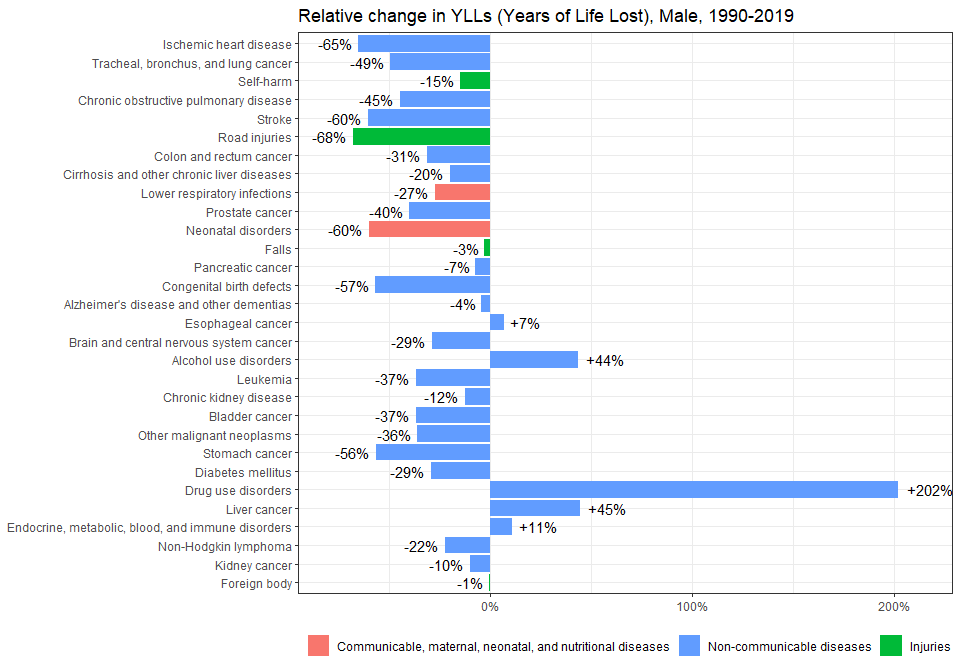
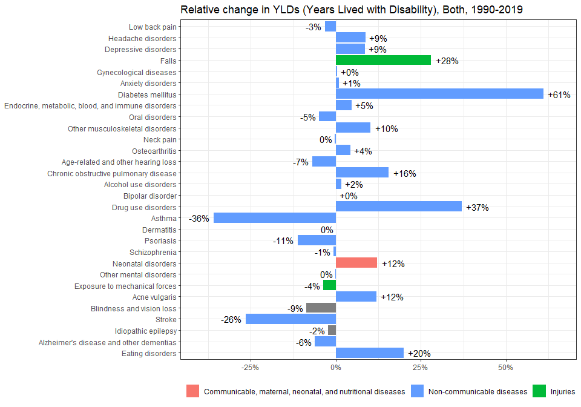
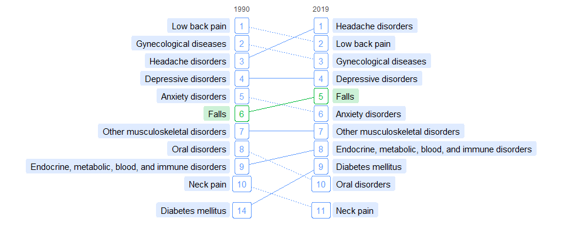

GBD2019 BELGIUM // PLOT
================
BrDe394
2021-11-03

  - [Settings](#settings)
  - [Data](#data)
  - [Dot plot](#dot-plot)
  - [Diff plot / Relative](#diff-plot--relative)
  - [Diff plot / Absolute](#diff-plot--absolute)
  - [Slope plot](#slope-plot)

# Settings

``` r
## required packages
library(ggplot2)
library(ggrepel)

## helper functions
dot_plot <-
function(y1, y2, .measure, .sex) {
  x1 <-
  subset(
    x,
    measure == .measure &
      location == "Belgium" &
      sex == .sex &
      year == y1)

  x2 <-
  subset(
    x,
    measure == .measure &
      location == "Belgium" &
      sex == .sex &
      year == y2)

  xx <- merge(x2, x1, by = "cause")

  xx$diff <- xx$val.x - xx$val.y
  xx$diff.pct <- xx$diff / xx$val.y

  xx <- head(xx[order(xx$val.x, decreasing = TRUE), ], 20)

  pct <- function(...) scales::percent(..., accuracy = 1)

  p <-
  ggplot(xx, aes(x = val.x, y = diff.pct)) +
    geom_hline(yintercept = 0) +
    geom_point() +
    geom_text_repel(
      aes(label = substr(cause, 0, 6))) +
    theme_bw() +
    scale_x_continuous(
      sprintf("%s, %s, %s", .measure, .sex, y2)) +
    scale_y_continuous(
      sprintf("Relative change, %s-%s", y1, y2), labels = pct)

  print(p)
  tiff(sprintf("fig/dotplot-%s-%s-%s-%s.tiff", .measure, .sex, y1, y2),
       10, 10, units = "in", res = 300, compress = "lzw")
  print(p)
  dev.off() 
}

diff_plot <-
function(y1, y2, .measure, .sex, relative = TRUE) {
  x1 <-
  subset(
    x,
    measure == .measure &
      location == "Belgium" &
      sex == .sex &
      year == 2019)

  x2 <-
  subset(
    x,
    measure == .measure &
      location == "Belgium" &
      sex == .sex &
      year == 1990)

  xx <- merge(x1, x2, by = "cause")

  xx$diff <- xx$val.x - xx$val.y
  xx$diff.pct <- xx$diff / xx$val.y
  xx$hjust <- ifelse(xx$diff < 0, 1.2, -0.2)

  pct <- function(...) scales::percent(..., accuracy = 1)
  xx$lab <-
  if (relative) {
    ifelse(xx$diff.pct > 0,
           paste0('+', pct(xx$diff.pct)),
           pct(xx$diff.pct))
  } else {
    ifelse(xx$diff > 0,
           paste0('+', round(xx$diff, 1)),
           formatC(xx$diff, format = "fg", digits = 2))
  }

  p <-
  ggplot(
    head(xx[order(xx$val.x, decreasing = TRUE), ], 30),
    aes_string(
      y = ifelse(relative, "diff.pct", "diff"),
      x = "reorder(cause, val.x)")) +
    geom_col(
      aes(fill = group.x)) +
    geom_text(
      aes(label = lab, hjust = hjust)) +
    theme_bw() +
    coord_flip() +
    scale_x_discrete(NULL) +
    scale_fill_discrete(
      NULL,
      breaks = sort(unique(causelist$LEVEL1))[c(1, 3, 2)]) +
    theme(legend.position = "bottom")
  if (relative) {
    p <- p +
         scale_y_continuous(
           NULL,
           labels = pct,
           expand = c(0.1, 0)) +
         ggtitle(
           sprintf("Relative change in %s, %s, %s-%s",
           .measure, .sex, y1, y2))
  } else {
    p <- p +
         scale_y_continuous(
           NULL,
           labels = scales::comma,
           expand = c(0.1, 0)) +
         ggtitle(
           sprintf("Absolute change in %s, %s, %s-%s",
           .measure, .sex, y1, y2))
  }

  print(p)

  tiff(sprintf("fig/diffplot-%s-%s-%s-%s-%s.tiff",
               .measure, .sex, y1, y2, ifelse(relative, "rel", "abs")),
       10, 7, units = "in", res = 300, compress = "lzw")
  print(p)
  dev.off() 
}

slope_plot <-
function() {

}
```

# Data

``` r
## check GBD2019-BE for data import
x <- readRDS("GBD2019.rds")

causelist <- bd::readxl("LEVELS.xlsx")
x$group <- causelist$LEVEL1[match(x$cause, causelist$LEVEL3)]
```

# Dot plot

``` r
dot_plot(1990, 2019, "Deaths", "Male")
```

    ## Warning in dev.off(): unable to open TIFF file 'fig/dotplot-Deaths-
    ## Male-1990-2019.tiff'

<!-- -->

    ## png 
    ##   2

``` r
dot_plot(1990, 2019, "Deaths", "Female")
```

    ## Warning in dev.off(): unable to open TIFF file 'fig/dotplot-Deaths-
    ## Female-1990-2019.tiff'

<!-- -->

    ## png 
    ##   2

``` r
dot_plot(1990, 2019, "Deaths", "Both")
```

    ## Warning in dev.off(): unable to open TIFF file 'fig/dotplot-Deaths-
    ## Both-1990-2019.tiff'

<!-- -->

    ## png 
    ##   2

``` r
dot_plot(1990, 2019, "YLLs (Years of Life Lost)", "Male")
```

    ## Warning in dev.off(): unable to open TIFF file 'fig/dotplot-YLLs (Years of Life
    ## Lost)-Male-1990-2019.tiff'

<!-- -->

    ## png 
    ##   2

``` r
dot_plot(1990, 2019, "YLLs (Years of Life Lost)", "Female")
```

    ## Warning in dev.off(): unable to open TIFF file 'fig/dotplot-YLLs (Years of Life
    ## Lost)-Female-1990-2019.tiff'

<!-- -->

    ## png 
    ##   2

``` r
dot_plot(1990, 2019, "YLLs (Years of Life Lost)", "Both")
```

    ## Warning in dev.off(): unable to open TIFF file 'fig/dotplot-YLLs (Years of Life
    ## Lost)-Both-1990-2019.tiff'

<!-- -->

    ## png 
    ##   2

``` r
dot_plot(1990, 2019, "YLDs (Years Lived with Disability)", "Male")
```

    ## Warning in dev.off(): unable to open TIFF file 'fig/dotplot-YLDs (Years Lived
    ## with Disability)-Male-1990-2019.tiff'

<!-- -->

    ## png 
    ##   2

``` r
dot_plot(1990, 2019, "YLDs (Years Lived with Disability)", "Female")
```

    ## Warning in dev.off(): unable to open TIFF file 'fig/dotplot-YLDs (Years Lived
    ## with Disability)-Female-1990-2019.tiff'

<!-- -->

    ## png 
    ##   2

``` r
dot_plot(1990, 2019, "YLDs (Years Lived with Disability)", "Both")
```

    ## Warning in dev.off(): unable to open TIFF file 'fig/dotplot-YLDs (Years Lived
    ## with Disability)-Both-1990-2019.tiff'

<!-- -->

    ## png 
    ##   2

``` r
dot_plot(1990, 2019, "DALYs (Disability-Adjusted Life Years)", "Male")
```

    ## Warning in dev.off(): unable to open TIFF file 'fig/dotplot-DALYs (Disability-
    ## Adjusted Life Years)-Male-1990-2019.tiff'

<!-- -->

    ## png 
    ##   2

``` r
dot_plot(1990, 2019, "DALYs (Disability-Adjusted Life Years)", "Female")
```

    ## Warning in dev.off(): unable to open TIFF file 'fig/dotplot-DALYs (Disability-
    ## Adjusted Life Years)-Female-1990-2019.tiff'

<!-- -->

    ## png 
    ##   2

``` r
dot_plot(1990, 2019, "DALYs (Disability-Adjusted Life Years)", "Both")
```

    ## Warning in dev.off(): unable to open TIFF file 'fig/dotplot-DALYs (Disability-
    ## Adjusted Life Years)-Both-1990-2019.tiff'

<!-- -->

    ## png 
    ##   2

# Diff plot / Relative

``` r
diff_plot(1990, 2019, "Deaths", "Male")
```

    ## Warning in dev.off(): unable to open TIFF file 'fig/diffplot-Deaths-
    ## Male-1990-2019-rel.tiff'

<!-- -->

    ## png 
    ##   2

``` r
diff_plot(1990, 2019, "Deaths", "Female")
```

    ## Warning in dev.off(): unable to open TIFF file 'fig/diffplot-Deaths-
    ## Female-1990-2019-rel.tiff'

<!-- -->

    ## png 
    ##   2

``` r
diff_plot(1990, 2019, "Deaths", "Both")
```

    ## Warning in dev.off(): unable to open TIFF file 'fig/diffplot-Deaths-
    ## Both-1990-2019-rel.tiff'

<!-- -->

    ## png 
    ##   2

``` r
diff_plot(1990, 2019, "YLLs (Years of Life Lost)", "Male")
```

    ## Warning in dev.off(): unable to open TIFF file 'fig/diffplot-YLLs (Years of Life
    ## Lost)-Male-1990-2019-rel.tiff'

<!-- -->

    ## png 
    ##   2

``` r
diff_plot(1990, 2019, "YLLs (Years of Life Lost)", "Female")
```

    ## Warning in dev.off(): unable to open TIFF file 'fig/diffplot-YLLs (Years of Life
    ## Lost)-Female-1990-2019-rel.tiff'

<!-- -->

    ## png 
    ##   2

``` r
diff_plot(1990, 2019, "YLLs (Years of Life Lost)", "Both")
```

    ## Warning in dev.off(): unable to open TIFF file 'fig/diffplot-YLLs (Years of Life
    ## Lost)-Both-1990-2019-rel.tiff'

<!-- -->

    ## png 
    ##   2

``` r
diff_plot(1990, 2019, "YLDs (Years Lived with Disability)", "Male")
```

    ## Warning in dev.off(): unable to open TIFF file 'fig/diffplot-YLDs (Years Lived
    ## with Disability)-Male-1990-2019-rel.tiff'

<!-- -->

    ## png 
    ##   2

``` r
diff_plot(1990, 2019, "YLDs (Years Lived with Disability)", "Female")
```

    ## Warning in dev.off(): unable to open TIFF file 'fig/diffplot-YLDs (Years Lived
    ## with Disability)-Female-1990-2019-rel.tiff'

<!-- -->

    ## png 
    ##   2

``` r
diff_plot(1990, 2019, "YLDs (Years Lived with Disability)", "Both")
```

    ## Warning in dev.off(): unable to open TIFF file 'fig/diffplot-YLDs (Years Lived
    ## with Disability)-Both-1990-2019-rel.tiff'

<!-- -->

    ## png 
    ##   2

``` r
diff_plot(1990, 2019, "DALYs (Disability-Adjusted Life Years)", "Male")
```

    ## Warning in dev.off(): unable to open TIFF file 'fig/diffplot-DALYs (Disability-
    ## Adjusted Life Years)-Male-1990-2019-rel.tiff'

<!-- -->

    ## png 
    ##   2

``` r
diff_plot(1990, 2019, "DALYs (Disability-Adjusted Life Years)", "Female")
```

    ## Warning in dev.off(): unable to open TIFF file 'fig/diffplot-DALYs (Disability-
    ## Adjusted Life Years)-Female-1990-2019-rel.tiff'

<!-- -->

    ## png 
    ##   2

``` r
diff_plot(1990, 2019, "DALYs (Disability-Adjusted Life Years)", "Both")
```

    ## Warning in dev.off(): unable to open TIFF file 'fig/diffplot-DALYs (Disability-
    ## Adjusted Life Years)-Both-1990-2019-rel.tiff'

<!-- -->

    ## png 
    ##   2

# Diff plot / Absolute

``` r
diff_plot(1990, 2019, "Deaths", "Male", rel = FALSE)
```

    ## Warning in dev.off(): unable to open TIFF file 'fig/diffplot-Deaths-
    ## Male-1990-2019-abs.tiff'

<!-- -->

    ## png 
    ##   2

``` r
diff_plot(1990, 2019, "Deaths", "Female", rel = FALSE)
```

    ## Warning in dev.off(): unable to open TIFF file 'fig/diffplot-Deaths-
    ## Female-1990-2019-abs.tiff'

<!-- -->

    ## png 
    ##   2

``` r
diff_plot(1990, 2019, "Deaths", "Both", rel = FALSE)
```

    ## Warning in dev.off(): unable to open TIFF file 'fig/diffplot-Deaths-
    ## Both-1990-2019-abs.tiff'

<!-- -->

    ## png 
    ##   2

``` r
diff_plot(
  1990, 2019, "YLLs (Years of Life Lost)", "Male", rel = FALSE)
```

    ## Warning in dev.off(): unable to open TIFF file 'fig/diffplot-YLLs (Years of Life
    ## Lost)-Male-1990-2019-abs.tiff'

<!-- -->

    ## png 
    ##   2

``` r
diff_plot(
  1990, 2019, "YLLs (Years of Life Lost)", "Female", rel = FALSE)
```

    ## Warning in dev.off(): unable to open TIFF file 'fig/diffplot-YLLs (Years of Life
    ## Lost)-Female-1990-2019-abs.tiff'

<!-- -->

    ## png 
    ##   2

``` r
diff_plot(
  1990, 2019, "YLLs (Years of Life Lost)", "Both", rel = FALSE)
```

    ## Warning in dev.off(): unable to open TIFF file 'fig/diffplot-YLLs (Years of Life
    ## Lost)-Both-1990-2019-abs.tiff'

<!-- -->

    ## png 
    ##   2

``` r
diff_plot(
  1990, 2019, "YLDs (Years Lived with Disability)", "Male", rel = FALSE)
```

    ## Warning in dev.off(): unable to open TIFF file 'fig/diffplot-YLDs (Years Lived
    ## with Disability)-Male-1990-2019-abs.tiff'

<!-- -->

    ## png 
    ##   2

``` r
diff_plot(
  1990, 2019, "YLDs (Years Lived with Disability)", "Female", rel = FALSE)
```

    ## Warning in dev.off(): unable to open TIFF file 'fig/diffplot-YLDs (Years Lived
    ## with Disability)-Female-1990-2019-abs.tiff'

<!-- -->

    ## png 
    ##   2

``` r
diff_plot(
  1990, 2019, "YLDs (Years Lived with Disability)", "Both", rel = FALSE)
```

    ## Warning in dev.off(): unable to open TIFF file 'fig/diffplot-YLDs (Years Lived
    ## with Disability)-Both-1990-2019-abs.tiff'

<!-- -->

    ## png 
    ##   2

``` r
diff_plot(
  1990, 2019, "DALYs (Disability-Adjusted Life Years)", "Male", rel = FALSE)
```

    ## Warning in dev.off(): unable to open TIFF file 'fig/diffplot-DALYs (Disability-
    ## Adjusted Life Years)-Male-1990-2019-abs.tiff'

<!-- -->

    ## png 
    ##   2

``` r
diff_plot(
  1990, 2019, "DALYs (Disability-Adjusted Life Years)", "Female", rel = FALSE)
```

    ## Warning in dev.off(): unable to open TIFF file 'fig/diffplot-DALYs (Disability-
    ## Adjusted Life Years)-Female-1990-2019-abs.tiff'

<!-- -->

    ## png 
    ##   2

``` r
diff_plot(
  1990, 2019, "DALYs (Disability-Adjusted Life Years)", "Both", rel = FALSE)
```

    ## Warning in dev.off(): unable to open TIFF file 'fig/diffplot-DALYs (Disability-
    ## Adjusted Life Years)-Both-1990-2019-abs.tiff'

<!-- -->

    ## png 
    ##   2

# Slope plot

``` r
slopegraph <-
function(n, .measure, .sex, y1, y2) {
  col <- c("#F8766D", "#00BA38", "#619CFF")

  x$group <- factor(x$group)

  df1 <-
  subset(x,
    location == "Belgium" & measure == .measure & sex == .sex & year == y1)
  df1 <- df1[order(df1$val, decreasing = TRUE), ]
  df1$rank <- seq(nrow(df1))

  df2 <-
  subset(x,
    location == "Belgium" & measure == .measure & sex == .sex & year == y2)
  df2 <- df2[order(df2$val, decreasing = TRUE), ]
  df2$rank <- seq(nrow(df2))

  df <- rbind(df1, df2)
  df <- subset(df, cause %in% c(head(df1$cause, n), head(df2$cause, n)))

  df$y <- (n+1) - df$rank
  df$y[df$year == y1 & df$y <= 0] <-
    -order(df$y[df$year == y1 & df$y <= 0], decreasing = TRUE) + 0.5
  df$y[df$year == y2 & df$y <= 0] <-
    -order(df$y[df$year == y2 & df$y <= 0], decreasing = TRUE) + 0.5

  df$diff <- 0
  df$diff[df$year == y1] <-
    df$rank[df$year == y1] <
      df$rank[df$year == y2][
        match(df$cause[df$year == y1], df$cause[df$year == y2])]
  df$diff[df$year == y2] <-
    df$rank[df$year == y2] >
      df$rank[df$year == y1][
        match(df$cause[df$year == y2], df$cause[df$year == y1])]

  p <-
  ggplot(df, aes(x = factor(year), y = y, group = cause)) +
    geom_line(aes(colour = group, linetype = as.character(diff))) +
    geom_label(aes(label = rank, colour = group),
               label.padding = unit(0.4, "lines")) +
    geom_label(data = subset(df, year == y1),
               aes(label = cause, fill = group),
               alpha = 0.2,
               label.size = NA,
               label.padding = unit(0.35, "lines"),
               hjust = 1,
               nudge_x = -0.15) +
    geom_label(data = subset(df, year == y2),
               aes(label = cause, fill = group),
               alpha = 0.2,
               label.size = NA,
               label.padding = unit(0.35, "lines"),
               hjust = 0,
               nudge_x = 0.15) +
    scale_y_discrete(NULL) +
    scale_x_discrete(NULL, position = "top", expand = c(3, 0)) +
    scale_color_manual(
      values = col[which(levels(df$group) %in% unique(df$group))]) +
    scale_fill_manual(
      values = col[which(levels(df$group) %in% unique(df$group))]) +
    theme_minimal() +
    theme(panel.grid = element_blank()) +
    theme(axis.text.y = element_blank()) +
    theme(legend.position = "none")

  print(p)

  tiff(sprintf("fig/slopegraph-%s-%s-%s-%s.tiff", .measure, .sex, y1, y2),
       10, 4, units = "in", res = 300, compress = "lzw")
  print(p)
  dev.off()
}

n <- 10

slopegraph(n, "Deaths", "Male", 1990, 2019)
```

    ## Warning in dev.off(): unable to open TIFF file 'fig/slopegraph-Deaths-
    ## Male-1990-2019.tiff'

<!-- -->

    ## png 
    ##   2

``` r
slopegraph(n, "Deaths", "Female", 1990, 2019)
```

    ## Warning in dev.off(): unable to open TIFF file 'fig/slopegraph-Deaths-
    ## Female-1990-2019.tiff'

<!-- -->

    ## png 
    ##   2

``` r
slopegraph(n, "Deaths", "Both", 1990, 2019)
```

    ## Warning in dev.off(): unable to open TIFF file 'fig/slopegraph-Deaths-
    ## Both-1990-2019.tiff'

<!-- -->

    ## png 
    ##   2

``` r
slopegraph(n, "YLLs (Years of Life Lost)", "Male", 1990, 2019)
```

    ## Warning in dev.off(): unable to open TIFF file 'fig/slopegraph-YLLs (Years of
    ## Life Lost)-Male-1990-2019.tiff'

<!-- -->

    ## png 
    ##   2

``` r
slopegraph(n, "YLLs (Years of Life Lost)", "Female", 1990, 2019)
```

    ## Warning in dev.off(): unable to open TIFF file 'fig/slopegraph-YLLs (Years of
    ## Life Lost)-Female-1990-2019.tiff'

<!-- -->

    ## png 
    ##   2

``` r
slopegraph(n, "YLLs (Years of Life Lost)", "Both", 1990, 2019)
```

    ## Warning in dev.off(): unable to open TIFF file 'fig/slopegraph-YLLs (Years of
    ## Life Lost)-Both-1990-2019.tiff'

<!-- -->

    ## png 
    ##   2

``` r
slopegraph(n, "YLDs (Years Lived with Disability)", "Male", 1990, 2019)
```

    ## Warning in dev.off(): unable to open TIFF file 'fig/slopegraph-YLDs (Years Lived
    ## with Disability)-Male-1990-2019.tiff'

<!-- -->

    ## png 
    ##   2

``` r
slopegraph(n, "YLDs (Years Lived with Disability)", "Female", 1990, 2019)
```

    ## Warning in dev.off(): unable to open TIFF file 'fig/slopegraph-YLDs (Years Lived
    ## with Disability)-Female-1990-2019.tiff'

<!-- -->

    ## png 
    ##   2

``` r
slopegraph(n, "YLDs (Years Lived with Disability)", "Both", 1990, 2019)
```

    ## Warning in dev.off(): unable to open TIFF file 'fig/slopegraph-YLDs (Years Lived
    ## with Disability)-Both-1990-2019.tiff'

<!-- -->

    ## png 
    ##   2

``` r
slopegraph(n, "DALYs (Disability-Adjusted Life Years)", "Male", 1990, 2019)
```

    ## Warning in dev.off(): unable to open TIFF file 'fig/slopegraph-DALYs
    ## (Disability-Adjusted Life Years)-Male-1990-2019.tiff'

<!-- -->

    ## png 
    ##   2

``` r
slopegraph(n, "DALYs (Disability-Adjusted Life Years)", "Female", 1990, 2019)
```

    ## Warning in dev.off(): unable to open TIFF file 'fig/slopegraph-DALYs
    ## (Disability-Adjusted Life Years)-Female-1990-2019.tiff'

<!-- -->

    ## png 
    ##   2

``` r
slopegraph(n, "DALYs (Disability-Adjusted Life Years)", "Both", 1990, 2019)
```

    ## Warning in dev.off(): unable to open TIFF file 'fig/slopegraph-DALYs
    ## (Disability-Adjusted Life Years)-Both-1990-2019.tiff'

<!-- -->

    ## png 
    ##   2

``` r
##rmarkdown::render("03-GBD2019-BE-plot.R")
```
