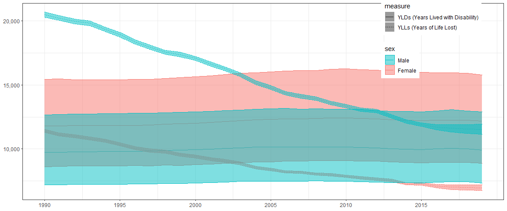

GBD2019 BELGIUM / TOTALS // PLOT
================
BrDe394
2021-11-03

  - [Settings](#settings)
  - [Data](#data)
  - [Evolution](#evolution)
  - [Comparison](#comparison)

# Settings

``` r
## knitr settings
knitr::opts_chunk$set(fig.width=12)

## required packages
library(ggplot2)

## helper functions
plot_evolution <-
function(.measure) {
  xlim <- seq(min(x$year), max(x$year), 5)
  p <-
  ggplot(
    subset(x,
      measure == .measure &
      sex != "Both"),
    aes(x = year, y = val)) +
    geom_line(aes(colour = sex)) +
    theme_bw() +
    scale_colour_discrete(breaks = c("Male", "Female")) +
    scale_x_continuous(NULL, breaks = xlim) +
    scale_y_continuous(.measure, labels = scales::comma)

  tiff(sprintf("fig/evolution-%s-%s-%s.tiff",
               .measure, min(x$year), max(x$year)),
       10, 4, units = "in", res = 300, compress = "lzw")
  print(p)
  dev.off()
}
```

# Data

``` r
x <- read.csv("../01_data/IHME-GBD_2019_DATA-a2387e1e-1.csv")
x$age <- x$metric <- x$cause <- x$location <- NULL
```

# Evolution

``` r
plot_evolution("Deaths")
```

    ## Warning in dev.off(): unable to open TIFF file 'fig/evolution-
    ## Deaths-1990-2019.tiff'

    ## png 
    ##   2

``` r
plot_evolution("YLLs (Years of Life Lost)")
```

    ## Warning in dev.off(): unable to open TIFF file 'fig/evolution-YLLs (Years of
    ## Life Lost)-1990-2019.tiff'

    ## png 
    ##   2

``` r
plot_evolution("YLDs (Years Lived with Disability)")
```

    ## Warning in dev.off(): unable to open TIFF file 'fig/evolution-YLDs (Years Lived
    ## with Disability)-1990-2019.tiff'

    ## png 
    ##   2

``` r
plot_evolution("DALYs (Disability-Adjusted Life Years)")
```

    ## Warning in dev.off(): unable to open TIFF file 'fig/evolution-DALYs (Disability-
    ## Adjusted Life Years)-1990-2019.tiff'

    ## png 
    ##   2

# Comparison

``` r
xlim <- seq(min(x$year), max(x$year), 5)
ggplot(
  subset(x,
    measure %in%
      c("YLLs (Years of Life Lost)", "YLDs (Years Lived with Disability)")&
    sex != "Both"),
  aes(x = year, y = val)) +
  geom_line(aes(colour = sex, linetype = measure)) +
  geom_ribbon(
    aes(ymin = lower, ymax = upper,
        colour = sex, fill = sex, linetype = measure),
    alpha = 0.5) +
  theme_bw() +
  scale_fill_discrete(breaks = c("Male", "Female")) +
  scale_colour_discrete(breaks = c("Male", "Female")) +
  scale_x_continuous(NULL, breaks = xlim) +
  scale_y_continuous(NULL, labels = scales::comma) +
  theme(legend.position = c(0.85, 0.82))
```

<!-- -->

``` r
tiff("fig/evolution-all.tiff", 10, 5, units = "in", res = 300, compress = "lzw")
ggplot(
  subset(x,
    measure %in%
      c("YLLs (Years of Life Lost)", "YLDs (Years Lived with Disability)")&
    sex != "Both"),
  aes(x = year, y = val)) +
  geom_line(aes(colour = sex, linetype = measure)) +
  theme_bw() +
  scale_colour_discrete(breaks = c("Male", "Female")) +
  scale_x_continuous(NULL, breaks = xlim) +
  scale_y_continuous(NULL, limits = c(5000, 20000), labels = scales::comma) +
  theme(legend.position = c(0.87, 0.8))
```

    ## Warning: Removed 2 row(s) containing missing values (geom_path).

``` r
dev.off()
```

    ## Warning in dev.off(): unable to open TIFF file 'fig/evolution-all.tiff'

    ## png 
    ##   2

``` r
##rmarkdown::render("05-GBD2019-BE-TOTALS-plot.R")
```
